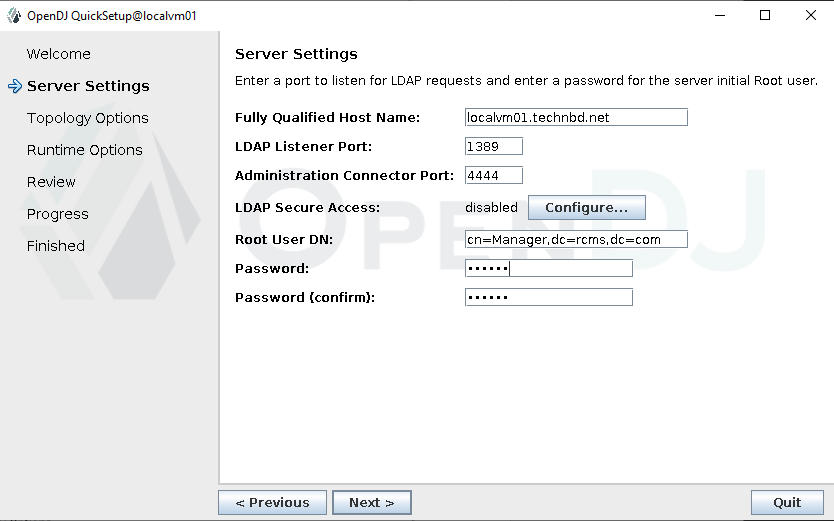
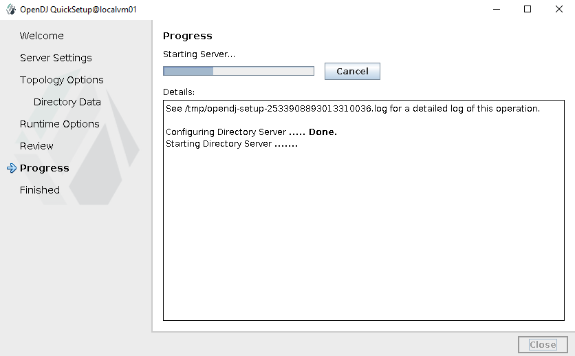

## OpenDJ LDAP v3.0:

OpenDJ is an LDAP directory server, but it's now maintained as ForgeRock Directory Services, which requires a subscription. However, you can use OpenDJ 3.0.0 (the last open-source version) or consider alternatives like OpenLDAP or 389 Directory Server, which are well-supported on Rocky Linux 8.


#### Prerequisites:
- JAVA Installed (java version 8)


_Verify the installation:_
```
java -version
```


### Set local DNS Entry:

```
vim /etc/hosts

192.168.10.193	localvm01.technbd.net     localvm01
```


### Download OpenDJ:

OpenDJ 3.0.0 is no longer maintained, but you can download it from an archive or repository like:


```
wget https://github.com/OpenRock/OpenDJ/releases/download/3.0.0/OpenDJ-3.0.0.zip
```


```
unzip OpenDJ-3.0.0.zip

cd opendj
```


### Setup OpenDJ (GUI):


#### Requires Info:

- Bind DN: Used to authenticate and bind to the LDAP server
- Base DN: Defines the starting point for searches or operations
- Root User DN: is the administrative account used to manage the LDAP server, perform configurations, and execute tasks such as adding, deleting, or modifying entries in the directory. **In OpenDJ, the Root User DN is usually set to `cn=Directory Manager`, but the exact DN can vary depending on how the server is configured.**


```
FQHN: localvm01.technbd.net
LDAP Listener Port: 1389
Administrator port: 4444

Bind DN: cn=Manager,dc=rcms,dc=com
Base DN: dc=rcms,dc=com

Root User DN: cn=Manager,dc=rcms,dc=com
password: your_password
```


_Run the OpenDJ setup (GUI mode):_

```
./setup
```


  
  
  
  
  
  
  
  


```
./bin/control-panel
```

  
  


### Check the service status:


```
./bin/status


### Output: 
>>>> Specify OpenDJ LDAP connection parameters

Administrator user bind DN [cn=Directory Manager]: "cn=Manager,dc=rcms,dc=com"

Password for user 'cn=Manager,dc=rcms,dc=com': secret

          --- Server Status ---
Server Run Status:        Started
Open Connections:         0

          --- Server Details ---
Host Name:                localvm01.technbd.net
Administrative Users:     cn=Manager,dc=rcms,dc=com
Installation Path:        /root/opendj
Version:                  OpenDJ 3.0.0
Java Version:             <not available> (*)
Administration Connector: Port 4444 (LDAPS)

          --- Connection Handlers ---
Address:Port : Protocol : State
-------------:----------:---------
--           : LDIF     : Disabled
0.0.0.0:636  : LDAPS    : Disabled
0.0.0.0:1389 : LDAP     : Enabled
0.0.0.0:1689 : JMX      : Disabled
0.0.0.0:8080 : HTTP     : Disabled

          --- Data Sources ---
Base DN:     dc=rcms,dc=com
Backend ID:  userRoot
Entries:     <not available> (*)
Replication:

```
 


```
netstat -tlpn | grep 1389
```


---
---


## Export Data from Old OpenDJ:

You need to export the existing LDAP data from your old OpenDJ instance.


_To check the backend IDs on your OpenDJ instance, run:_

```
./bin/dsconfig list-backends --hostname localhost --port 4444 --bindDN "cn=Manager,dc=rcms,dc=com" --bindPassword secret --trustAll


Backend   : Type : enabled : base-dn
----------:------:---------:-----------------
adminRoot : ldif : true    : cn=admin data
userRoot  : je   : true    : "dc=rcms,dc=com"
```


#### Check if the Root Entry Exists:

If this command does not return `dc=rcms,dc=com`, the base DN does not exist.

```
./bin/ldapsearch -p 1389 -b "" -s base "(objectClass=*)"
./bin/ldapsearch -p 1389 -b "" -s base "(objectClass=*)" dn 
```


#### Verify Your LDAP Database (LDAP Entries):

Check if your LDAP directory contains the `dc=rcms,dc=com` entry. If `dc=rcms,dc=com` is missing, you may need to create it.  

You can list all available DNs with:

```
./bin/ldapsearch -p 1389 -b "" -s sub "(objectClass=*)"
./bin/ldapsearch -p 1389 -b "" -s sub "(objectClass=*)" dn
```


### Export LDIF Data:


```
ll db/userRoot/je.lck
```


_If the file `je.lck` exists, backup or remove it:_

```
cd db/userRoot

mv je.lck  je.lck.bak
```


a. Export using `export-ldif`:

_Run the following command on your old OpenDJ server:_

```
./bin/export-ldif --includeBranch dc=rcms,dc=com --backendId userRoot --ldifFile /home/backup-ldap.08042025.ldif
```


b. Backup Schema (if customized):

_If you have custom schema modifications, back them up:_

```
cp -r opendj/config/schema /home/schema_backup
```


## Import Data into New OpenDJ: 

```
./bin/import-ldif --port 4444 --bindDN "cn=Manager,dc=rcms,dc=com" -n userRoot --bindPassword secret -l /home/rcmsOrganization.ldif
```


```
cp /home/99-user.ldif config/schema/
```


```
./bin/stop-ds
./bin/start-ds
```


### Import LDIF Data: 

```
./bin/import-ldif --port 4444 --bindDN "cn=Manager,dc=rcms,dc=com" -n userRoot --bindPassword secret -l /home/backup-ldap.08042025.ldif

./bin/import-ldif --bindDN "cn=Manager,dc=rcms,dc=com" -n userRoot --trustAll --noPropertiesFile -l /home/beta_ldap_basedn_20241209.ldif
```


_After importing the data, verify that everything works as expected:_

```
./bin/ldapsearch -p 1389 -D "cn=Manager,dc=rcms,dc=com" -b "dc=rcms,dc=com" -w 'secret' "(objectClass=*)"

./bin/ldapsearch -p 1389 -b "dc=rcms,dc=com" "(objectClass=*)"
```


By following these steps, you can successfully migrate your OpenDJ LDAP data to a new server. The `--backendID` is critical to ensure the data is handled correctly, as it specifies which backend to operate on (default is usually `userRoot`).


