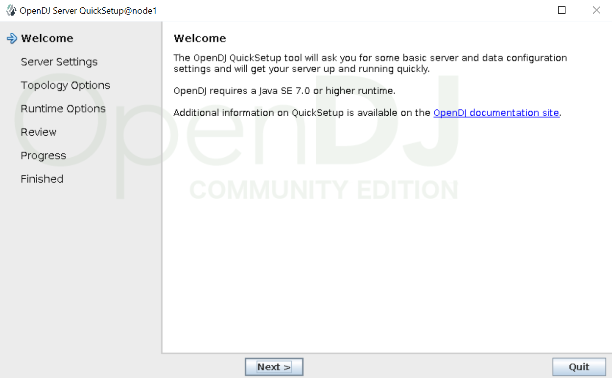
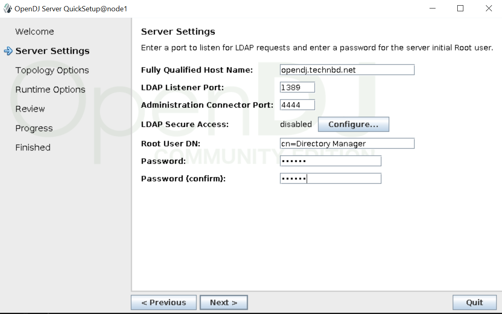
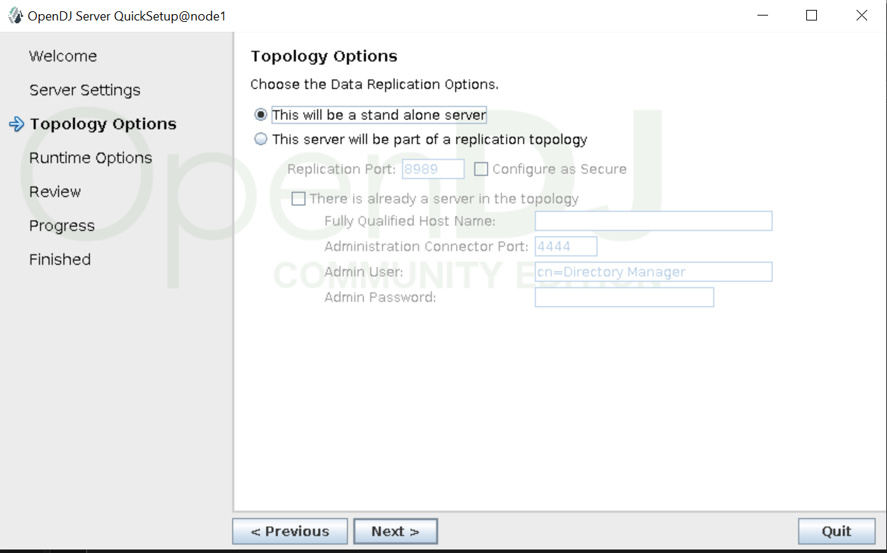
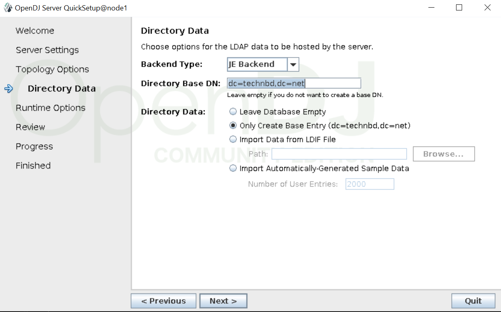
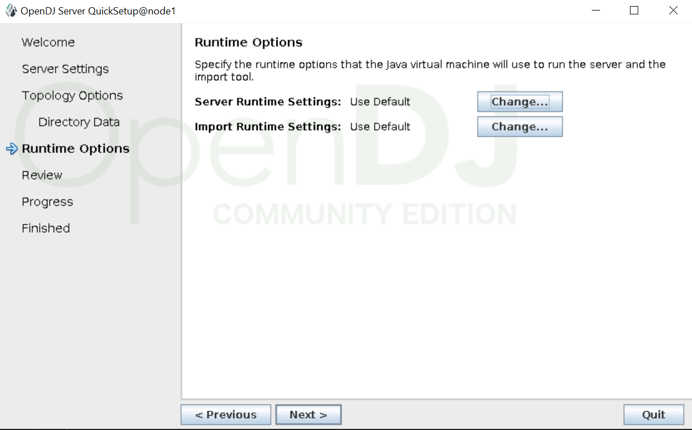
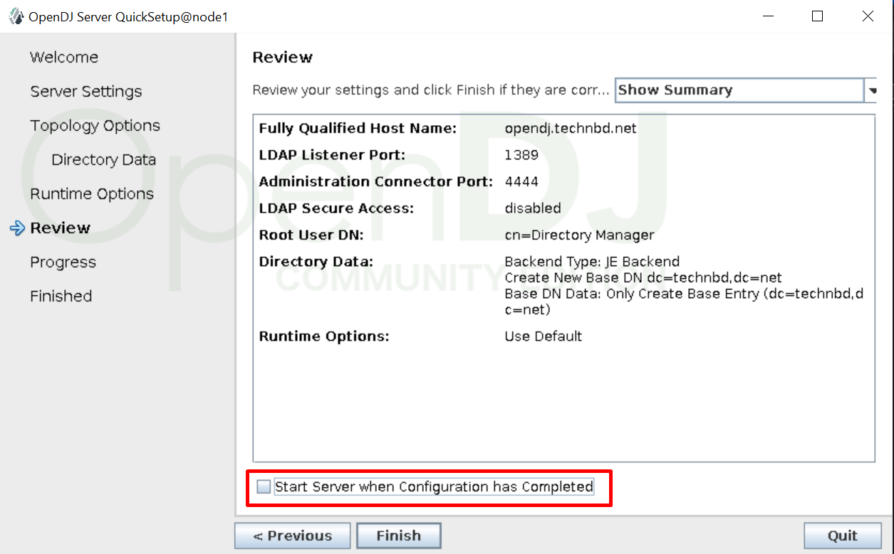
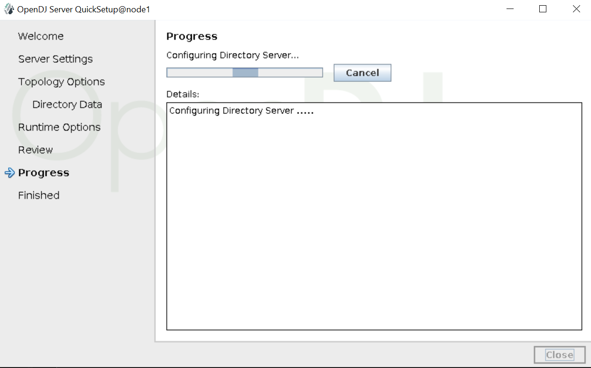
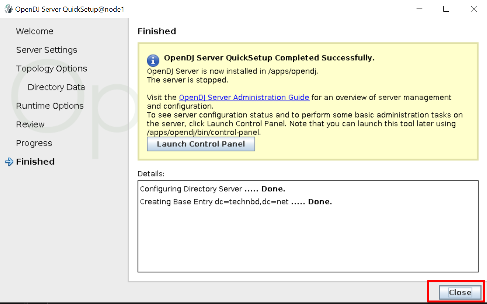

## OpenDJ GUI setup: 


### Download OpenDJ:

Change to the directory where you extracted the OpenDJ files: 

```
mkdir /apps/
cd /apps
```


```
wget https://github.com/OpenIdentityPlatform/OpenDJ/releases/download/4.5.4/opendj-4.5.4.zip
```


```
unzip opendj-4.5.4.zip
```


```
cd opendj
```


```
java -version

echo $JAVA_HOME
```


### Install OpenDJ using GUI mode: 

```
./setup 
```

  

  

  

  

  

  

  

  


### Start OpenDJ:


_Set Java Home:_

```
vim config/java.properties


## Un-comment this and add java home: 
default.java-home=/apps/jdk-1.8/jdk1.8.0_371
```


```
./bin/start-ds
```


```
./bin/status


### Output:

>>>> Specify OpenDJ LDAP connection parameters

Administrator user bind DN [cn=Directory Manager]:  [-> Hit Enter]

Password for user 'cn=Directory Manager':  [-> Hit Enter]

          --- Server Status ---
Server Run Status:        Started
Open Connections:         0

          --- Server Details ---
Host Name:                node1
Administrative Users:     cn=Directory Manager
Installation Path:        /apps/opendj
Version:                  OpenDJ Server 4.5.4
Java Version:             <not available> (*)
Administration Connector: Port 4444 (LDAPS)

          --- Connection Handlers ---
Address:Port : Protocol : State
-------------:----------:---------
--           : LDIF     : Disabled
0.0.0.0:636  : LDAPS    : Disabled
0.0.0.0:1389 : LDAP     : Enabled
0.0.0.0:1689 : JMX      : Disabled
0.0.0.0:8080 : HTTP     : Disabled

          --- Data Sources ---
Base DN:     dc=technbd,dc=net
Backend ID:  userRoot
Entries:     <not available> (*)
Replication:

* Information only available if you provide valid authentication information
when launching the status command.
```


```
./stop-ds
```


### OpenDJ Control Panel: [Worked]

_Login success:_

```
./bin/control-panel
```


## Verify Directory Services: (Basic Search)


The `ldapsearch` command is used to query an LDAP directory: 

- `-b` --baseDN :  	base dn for search
- `-D` --bindDN : 	bind DN
- `-h` --hostname :	LDAP server
- `-p` --port :   	port on LDAP server; Default value: 389
- `-w` --bindPassword :  bind password (for simple authentication)
- `-W` --keyStorePassword :	{keyStorePassword} prompt for bind password
- `-X`, --trustAll : Trust all server SSL certificates
- `-Y` --proxyAs {authzID} : Use the proxied authorization control with the given authorization ID
- `-Z` --useSSL : Use SSL for secure communication with the server

- Note: `1389` for non-SSL LDAP, `636` for LDAPS, `4444` for admin port).


_Syntax:_

```
./bin/ldapsearch -h <hostname> -p <port> -D <bindDN> -w <password> -b <baseDN> "<search filter>"
```


_Search for all entries under the base DN:_

```
./bin/ldapsearch -h 192.168.10.192 -p 1389 -D "cn=Directory Manager" -w opendj -b "dc=technbd,dc=net" "(objectClass=*)"


### Output:

dn: dc=technbd,dc=net
dc: technbd
objectClass: domain
objectClass: top

```


