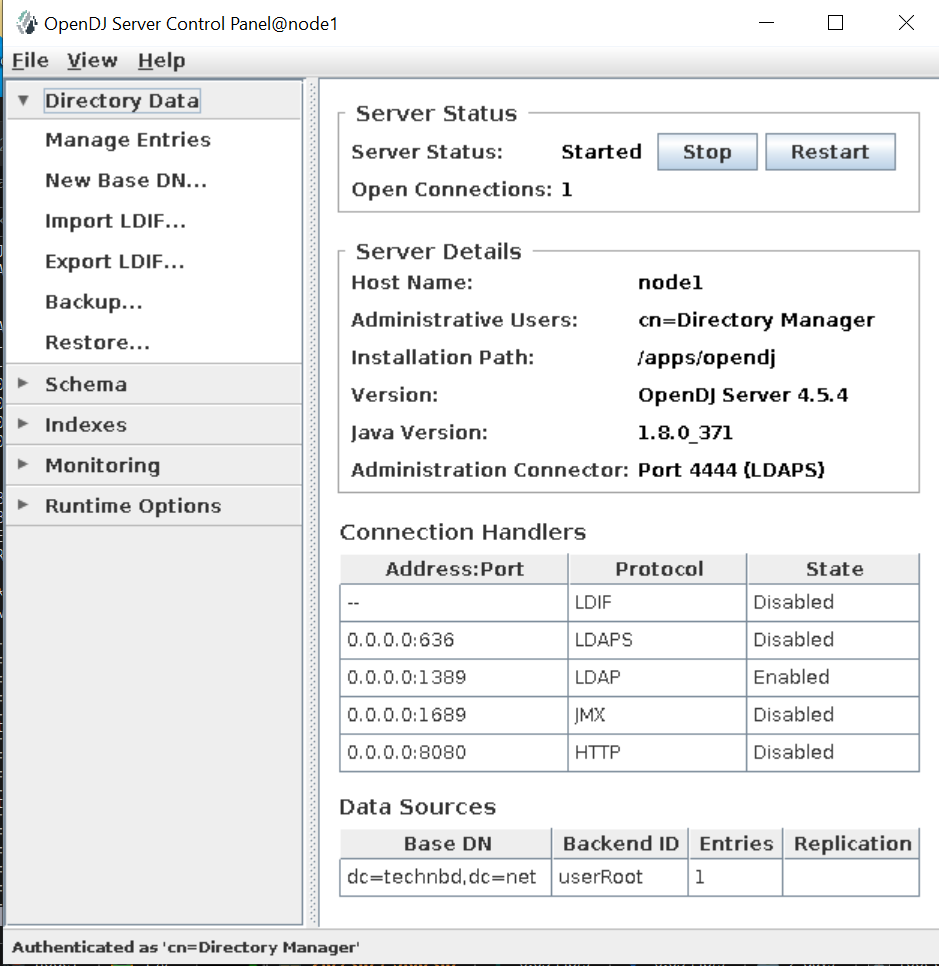

## Install Opendj v4.5.4:


### Download OpenDJ:

Change to the directory where you extracted the OpenDJ files: 

```
mkdir /apps/
cd /apps
```


```
wget https://github.com/OpenIdentityPlatform/OpenDJ/releases/download/4.5.4/opendj-4.5.4.zip
```


```
unzip opendj-4.5.4.zip
```


```
cd opendj
```


```
java -version

echo $JAVA_HOME
```


### Install OpenDJ using CLI mode: 


```
./setup --cli
```


```
### Output: 

What would you like to use as the initial root user DN for the Directory

Server? [cn=Directory Manager]:     [-> Hit Enter]

Please provide the password to use for the initial root user: opendj       [-> Hit Enter]
Please re-enter the password for confirmation: opendj      [-> Hit Enter]

Provide the fully-qualified directory server host name that will be used when
generating self-signed certificates for LDAP SSL/StartTLS, the administration
connector, and replication [node1]: opendj.technbd.net      [-> Hit Enter]

On which port would you like the Directory Server to accept connections from
LDAP clients? [389]: 1389       [-> Hit Enter]

On which port would you like the Administration Connector to accept
connections? [4444]:        [-> Hit Enter]

Do you want to create base DNs in the server? (yes / no) [yes]: yes     [-> Hit Enter]

Provide the backend type:

    1)  JE Backend
    2)  PDB Backend

Enter choice [1]: 1     [-> Hit Enter]

Provide the base DN for the directory data: [dc=example,dc=com]: dc=technbd,dc=net      [-> Hit Enter]
Options for populating the database:

    1)  Leave the database empty
    2)  Only create the base entry
    3)  Import data from an LDIF file
    4)  Load automatically-generated sample data

Enter choice [1]: 2     [-> Hit Enter]

Do you want to enable SSL? (yes / no) [no]: no      [-> Hit Enter]

Do you want to enable Start TLS? (yes / no) [no]: no        [-> Hit Enter]

Do you want to start the server when the configuration is completed? (yes /
no) [yes]: no       [-> Hit Enter]


Setup Summary
=============
LDAP Listener Port:            1389
Administration Connector Port: 4444
JMX Listener Port:
LDAP Secure Access:            disabled
Root User DN:                  cn=Directory Manager
Directory Data:                Backend Type: JE Backend
                               Create New Base DN dc=technbd,dc=net
Base DN Data: Only Create Base Entry (dc=technbd,dc=net)

Do not start Server when the configuration is completed


What would you like to do?

    1)  Set up the server with the parameters above
    2)  Provide the setup parameters again
    3)  Print equivalent non-interactive command-line
    4)  Cancel and exit

Enter choice [1]: 1     [-> Hit Enter]

Configuring Directory Server ..... Done.
Creating Base Entry dc=technbd,dc=net ..... Done.

To see basic server configuration status and configuration, you can launch
/apps/opendj/bin/status

```


_Set Java Home:_

```
vim config/java.properties


## Un-comment this and add java home: 
default.java-home=/apps/jdk-1.8/jdk1.8.0_371
```


```
chmod +x -R bin
chmod +x -R lib
```


```
./bin/status -V


OpenDJ Server 4.5.4
Build 20221209101029
--
           Name                 Build number         Revision number
Extension: snmp-mib2605         4.5.4                d967673e1af894245300dc734496caf0a74701d4
```


```
./bin/start-ds
```


```
./bin/status


### Output: 

>>>> Specify OpenDJ LDAP connection parameters

Administrator user bind DN [cn=Directory Manager]:

Password for user 'cn=Directory Manager':

          --- Server Status ---
Server Run Status:        Started
Open Connections:         0

          --- Server Details ---
Host Name:                node1
Administrative Users:     cn=Directory Manager
Installation Path:        /apps/opendj
Version:                  OpenDJ Server 4.5.4
Java Version:             <not available> (*)
Administration Connector: Port 4444 (LDAPS)

          --- Connection Handlers ---
Address:Port : Protocol : State
-------------:----------:---------
--           : LDIF     : Disabled
0.0.0.0:636  : LDAPS    : Disabled
0.0.0.0:1389 : LDAP     : Enabled
0.0.0.0:1689 : JMX      : Disabled
0.0.0.0:8080 : HTTP     : Disabled

          --- Data Sources ---
Base DN:     dc=technbd,dc=net
Backend ID:  userRoot
Entries:     <not available> (*)
Replication:

* Information only available if you provide valid authentication information
when launching the status command.
```


_Stop command:_

```
./bin/stop-ds
```


```
netstat -tlpn | grep 1389

tcp6       0      0 :::1389                 :::*                    LISTEN      43112/java
```


```
netstat -tlpn | grep 4444

tcp6       0      0 :::4444                 :::*                    LISTEN      79166/java
```


---
---


## OpenDJ Control Panel: [Worked]

OpenDJ Control Panel offers a graphical user interface for managing both local and remote servers. You choose the server to manage when you start the Control Panel. The Control Panel connects to the administration server port, making a secure LDAPS connection.


_Start OpenDJ Control Panel:_ 
- (UNIX) Run `./bin/control-panel` 
- (Windows) Double-click `bat\control-panel.bat`


```
./bin/control-panel
```


### Login success: 

  




## Verify Directory Services: (Basic Search)

The `ldapsearch` command is used to query an LDAP directory: 

- `-b` --baseDN :  	base dn for search
- `-D` --bindDN : 	bind DN
- `-h` --hostname :	LDAP server
- `-p` --port :   	port on LDAP server; Default value: 389
- `-w` --bindPassword :  bind password (for simple authentication)
- `-W` --keyStorePassword :	{keyStorePassword} prompt for bind password
- `-X`, --trustAll : Trust all server SSL certificates
- `-Y` --proxyAs {authzID} : Use the proxied authorization control with the given authorization ID
- `-Z` --useSSL : Use SSL for secure communication with the server

- Note: `1389` for non-SSL LDAP, `636` for LDAPS, `4444` for admin port).


_Syntax:_

```
./bin/ldapsearch -h <hostname> -p <port> -D <bindDN> -w <password> -b <baseDN> "<search filter>"
```


_Search for all entries under the base DN:_

```
./bin/ldapsearch -h 192.168.10.192 -p 1389 -D "cn=Directory Manager" -w opendj -b "dc=technbd,dc=net" "(objectClass=*)"


### Output:

dn: dc=technbd,dc=net
dc: technbd
objectClass: domain
objectClass: top

```


